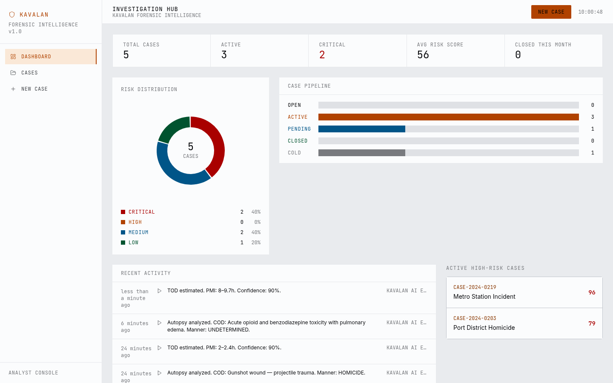
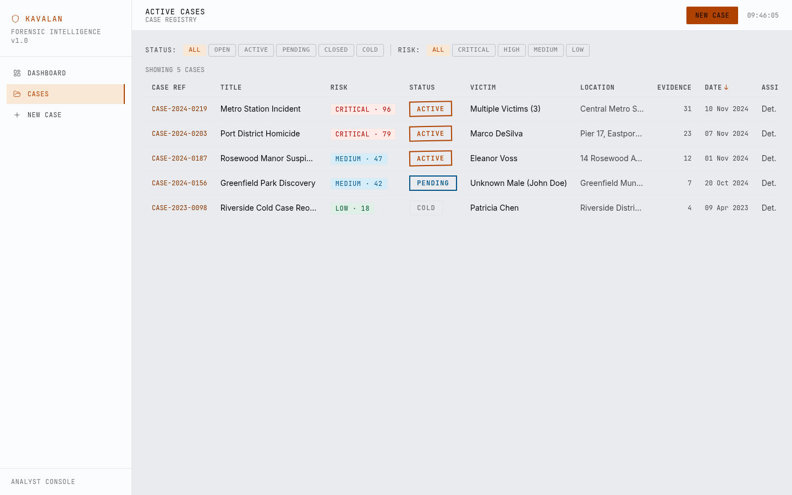
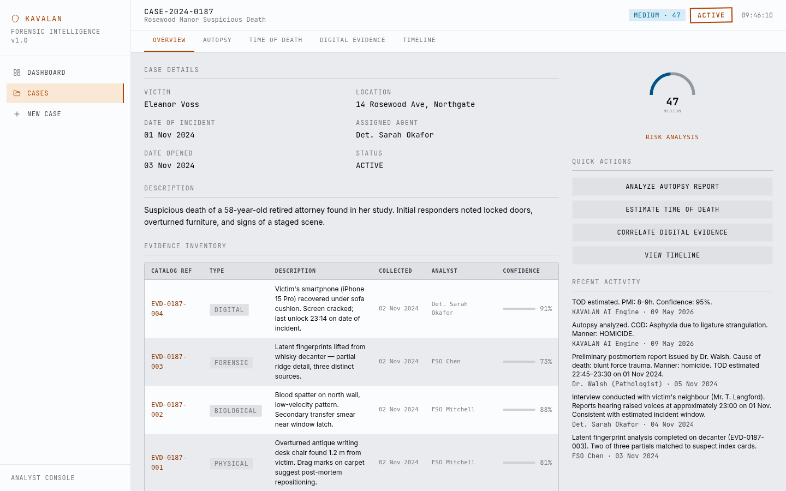
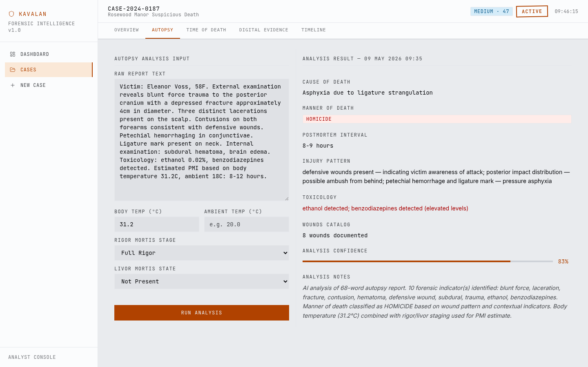
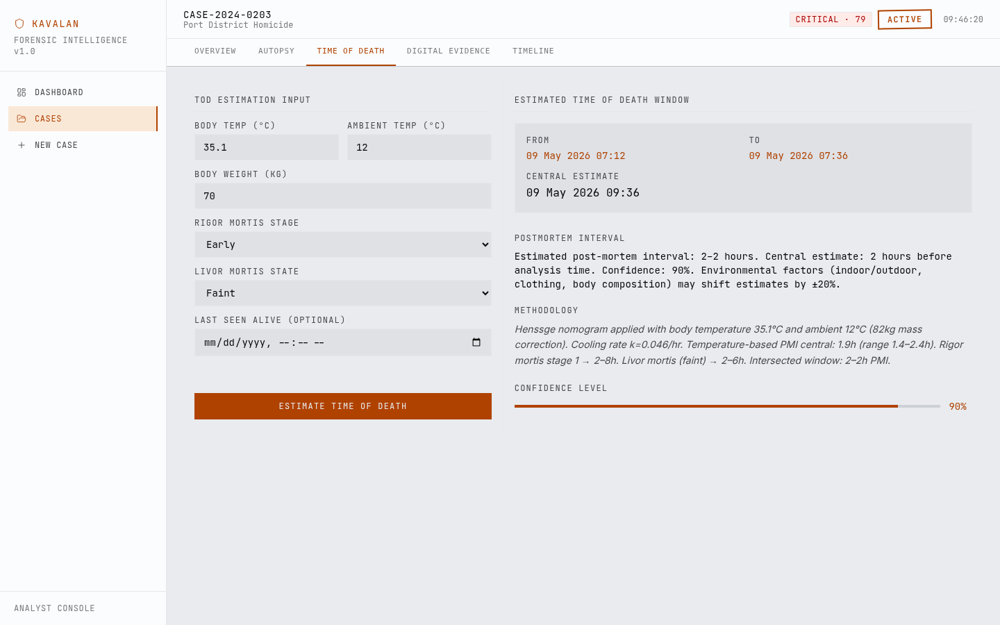
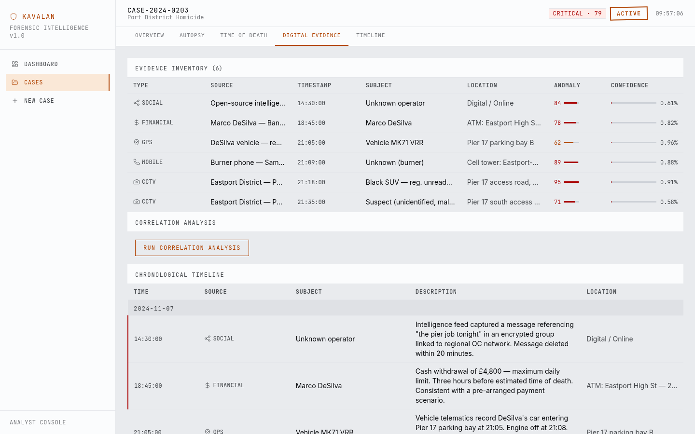
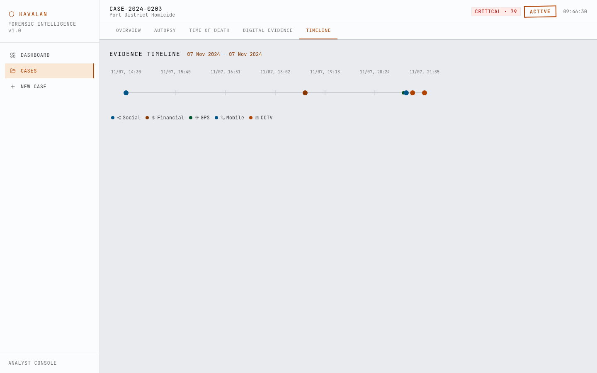
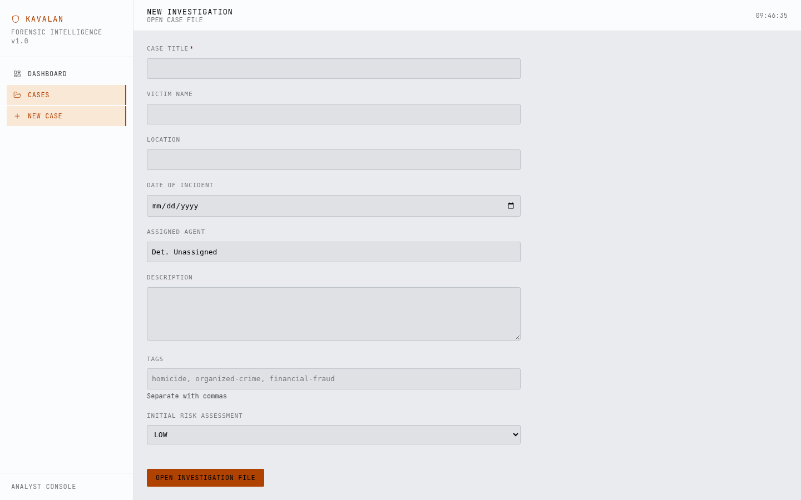

# KAVALAN — Complete Usage Guide

### Step-by-step: Installation, Setup, and Every Page Explained

---

## What Is KAVALAN?

**KAVALAN** (காவலன் — _Guardian_ in Tamil) is an AI-powered forensic triage and postmortem intelligence system. It helps investigators organize, analyze, and correlate forensic and digital evidence across five core modules:

1. Investigation Hub Dashboard
2. AI Autopsy Report Analyzer
3. Time-of-Death (TOD) Estimator
4. Digital Evidence Correlator
5. Evidence Timeline Rail

Everything runs **locally on your machine**. No internet required after setup. No data leaves your device.

---

## Part 1: Getting the App Running

### Prerequisites

You need the following installed:

| Tool    | Version                                        | Check with       |
| ------- | ---------------------------------------------- | ---------------- |
| Node.js | 22 or higher (must be 22+ for built-in SQLite) | `node --version` |
| npm     | 8 or higher                                    | `npm --version`  |
| Git     | any                                            | `git --version`  |

> **Why Node 22+?** KAVALAN uses Node's built-in `node:sqlite` module — no external database installation needed. No PostgreSQL, no MySQL, nothing to configure.

---

### Step 1 — Clone or Navigate to the Project

```bash
cd /home/haz3/code/test/slop/aiventra
```

Or if cloning fresh:

```bash
git clone <repo-url>
cd aiventra
```

---

### Step 2 — Install Dependencies

```bash
npm install
```

This installs:

- `next` — the web framework
- `react`, `react-dom` — UI rendering
- `recharts` — charts (donut chart, bar chart)
- `framer-motion` — page animations
- `lucide-react` — icons
- `date-fns` — date formatting
- `clsx`, `tailwind-merge` — styling utilities

Takes about 30–60 seconds.

---

### Step 3 — Start the Development Server

```bash
npm run dev
```

You will see:

```
▲ Next.js 14.x
  - Local: http://localhost:4000

✓ Starting...
✓ Ready in ~1200ms
```

> The app runs on **port 4000** (not 3000) to avoid conflicts.

---

### Step 4 — Open the App

Open your browser and go to:

```
http://localhost:4000
```

The database is created automatically on first load at `./data/kavalan.db` and seeded with **5 realistic demo cases** — no manual setup required.

---

## Part 2: Page-by-Page Walkthrough

---

### Page 1 — Investigation Hub (Dashboard)

**URL:** `http://localhost:4000`



**What you see:**

The dashboard is your command centre. It loads instantly and gives you a real-time picture of all active investigations.

**Reading the Stats Strip (top row):**

| Metric            | What it means                                                               |
| ----------------- | --------------------------------------------------------------------------- |
| TOTAL CASES       | All cases in the system regardless of status                                |
| ACTIVE            | Cases currently being investigated                                          |
| CRITICAL          | Cases with risk score 76–100 (needs immediate attention)                    |
| AVG RISK SCORE    | Mean risk score across all cases — rising number = rising caseload pressure |
| CLOSED THIS MONTH | Resolution rate indicator                                                   |

**Reading the Risk Distribution (left donut):**

The donut chart shows how your caseload breaks down by risk tier:

- 🔴 **CRITICAL** — execution-style homicides, mass casualty events
- 🟠 **HIGH** — suspicious deaths with staging evidence
- 🔵 **MEDIUM** — unidentified victims, pending toxicology
- 🟢 **LOW** — cold cases, historical investigations

**Reading the Case Pipeline (right bars):**

Shows how many cases sit at each stage: OPEN → ACTIVE → PENDING → CLOSED → COLD. A healthy pipeline has most cases moving from ACTIVE toward CLOSED. A pipeline stuck at ACTIVE with nothing in PENDING suggests evidence bottlenecks.

**Reading Recent Activity (bottom left):**

A live feed of the last actions performed in the system — analyses run, evidence added, status changes. Each entry shows the timestamp, action type (icon), description, and which agent or analyst triggered it.

**Reading Active High-Risk Cases (bottom right):**

The top 3 CRITICAL/HIGH cases sorted by risk score. Click any row to jump straight into that case workspace.

---

### Page 2 — Case Registry

**URL:** `http://localhost:4000/cases`



**What you see:**

A full sortable table of every case in the system.

**How to filter:**

At the top you have two filter strips:

- **STATUS filters:** ALL · OPEN · ACTIVE · PENDING · CLOSED · COLD
  - Click any status button — table updates instantly
  - Active filter shows in amber
- **RISK filters:** ALL · CRITICAL · HIGH · MEDIUM · LOW
  - Combine with status — e.g. ACTIVE + CRITICAL shows only the most urgent open cases

**Reading the table columns:**

| Column   | What it means                                                    |
| -------- | ---------------------------------------------------------------- |
| CASE REF | System-generated unique ID (CASE-2024-0187) — click to open case |
| TITLE    | Short case description                                           |
| RISK     | Risk badge showing tier + numeric score                          |
| STATUS   | Current stage stamp                                              |
| VICTIM   | Victim name or "Unknown"                                         |
| LOCATION | Incident location                                                |
| EVIDENCE | Count of catalogued evidence items                               |
| DATE     | Date of incident                                                 |
| ASSIGNEE | Assigned detective                                               |

**How to sort:**

Click any column header to sort ascending. Click again for descending. An arrow (↑↓) shows the active sort column.

**How to open a case:**

Click any row. You'll go to that case's full workspace.

---

### Page 3 — Case Overview

**URL:** `http://localhost:4000/cases/[id]`  
_(e.g. `http://localhost:4000/cases/case-001`)_



**What you see:**

The case workspace opens with five tabs across the top:
**OVERVIEW · AUTOPSY · TIME OF DEATH · DIGITAL EVIDENCE · TIMELINE**

The active tab is underlined in amber.

**Left panel — Case Details:**

A two-column grid of key facts: Victim, Location, Date of Incident, Assigned Agent, Date Opened, Status. All in monospace font for precision reading.

Below that: the full case description in plain text, followed by the complete **Evidence Inventory** table.

**Evidence Inventory table columns:**

| Column      | What it means                                                    |
| ----------- | ---------------------------------------------------------------- |
| CATALOG REF | Evidence item ID (EVD-0187-001) — unique per case                |
| TYPE        | PHYSICAL / DIGITAL / BIOLOGICAL / FORENSIC / TESTIMONIAL         |
| DESCRIPTION | Full description of the evidence item                            |
| COLLECTED   | When it was collected (date)                                     |
| ANALYST     | Who collected/processed it                                       |
| CONFIDENCE  | Thin bar + percentage — how reliable this evidence item is rated |

**Right panel — Risk Gauge:**

An SVG arc gauge showing the case's current risk score from 0 to 100. The arc fills to the score value and changes colour by tier:

- 0–25: sage green (LOW)
- 26–50: sky blue (MEDIUM)
- 51–75: amber (HIGH)
- 76–100: crimson (CRITICAL)

Click **RISK ANALYSIS** below the gauge to re-run the AI risk scoring — it will recalculate based on current evidence, suspects, digital anomalies, and forensic completeness.

**Quick Actions:**

Four buttons that jump directly to each analysis tab:

- ANALYZE AUTOPSY REPORT
- ESTIMATE TIME OF DEATH
- CORRELATE DIGITAL EVIDENCE
- VIEW TIMELINE

**Recent Activity sidebar:**

The last 5 actions on this specific case — useful for knowing what analysis has already been run.

---

### Page 4 — Autopsy Analyzer

**URL:** `http://localhost:4000/cases/[id]/autopsy`



**What you see:**

A two-pane layout. Left: input form. Right: analysis output.

**Step-by-step: Running an autopsy analysis**

**Step 1 — Paste the autopsy report text**

Click the large textarea on the left labelled **RAW REPORT TEXT**. Paste the complete autopsy report. The AI engine will work on whatever text you give it — it extracts forensic signals from unstructured language.

Example of what to paste:

```
Victim: Jane Doe, 42F. External examination reveals blunt force trauma
to the posterior cranium. Defensive wounds on both forearms. Petechial
hemorrhaging in conjunctivae. Ligature mark on neck. Toxicology:
ethanol 0.08%, benzodiazepines detected.
```

**Step 2 — Enter physical measurements (optional but improves accuracy)**

- **Body Temp (°C)** — the body temperature at scene discovery
- **Ambient Temp (°C)** — air temperature at the scene

These are used by the TOD sub-engine within the autopsy analysis.

**Step 3 — Set postmortem indicators**

- **Rigor Mortis Stage**
  - None → body is still warm/flexible (death < 2 hours)
  - Early Onset → stiffness beginning (2–8 hours)
  - Full Rigor → completely rigid (8–18 hours)
  - Resolving → stiffness releasing (18–48 hours)
- **Livor Mortis State**
  - Not Present → no pooling (< 2 hours)
  - Faint → light discolouration (2–6 hours)
  - Well-Defined → clear fixed patterns (6–12 hours)
  - Fixed → fully set, won't shift with pressure (12+ hours)

**Step 4 — Click RUN ANALYSIS**

The right pane populates with:

| Output field        | What it means                                                                  |
| ------------------- | ------------------------------------------------------------------------------ |
| CAUSE OF DEATH      | Primary mechanism (e.g. "Asphyxia due to ligature strangulation")              |
| MANNER OF DEATH     | Legal classification: HOMICIDE / SUICIDE / NATURAL / ACCIDENTAL / UNDETERMINED |
| POSTMORTEM INTERVAL | Estimated hours since death (e.g. "8–9 hours")                                 |
| INJURY PATTERN      | Narrative of wound distribution and what it suggests                           |
| TOXICOLOGY          | Substances detected and significance                                           |
| WOUNDS CATALOG      | Count + notes on injury inventory                                              |
| ANALYSIS CONFIDENCE | 0–100% bar — higher = more forensic keywords found + clearer indicators        |
| ANALYSIS NOTES      | Full transparency on what the AI extracted and how it classified it            |

> All results are saved to the database automatically. Next time you open this case, the analysis is pre-loaded.

---

### Page 5 — Time of Death Estimator

**URL:** `http://localhost:4000/cases/[id]/tod`



**What you see:**

Same two-pane layout. Left: measurements form. Right: TOD window result.

**Step-by-step: Estimating time of death**

**Step 1 — Enter temperatures**

- **Body Temp (°C)** — core body temperature at scene
- **Ambient Temp (°C)** — air temperature at scene

The bigger the gap between these two numbers, the more recently death occurred. A body at 37°C in a 20°C room died recently. A body at 21°C in a 20°C room died a long time ago.

**Step 2 — Enter body weight (optional)**

Default is 70 kg. A heavier body retains heat longer — this adjusts the Henssge cooling constant.

**Step 3 — Set rigor and livor mortis (same as autopsy page)**

These act as independent cross-checks on the temperature-based estimate. The engine intersects all three windows to produce the tightest possible PMI range.

**Step 4 — Set Last Seen Alive (optional but important)**

If you know when the victim was last confirmed alive (e.g. a phone call at 22:00, a CCTV sighting at 21:47), enter it here. This creates a hard upper bound — the system will constrain the TOD window to not exceed this point.

**Step 5 — Click ESTIMATE TIME OF DEATH**

The right pane shows:

**ESTIMATED TIME OF DEATH WINDOW**

```
FROM    09 May 2026 07:12
TO      09 May 2026 07:36
```

**CENTRAL ESTIMATE** — the single most likely time of death

**POSTMORTEM INTERVAL** — e.g. "2–2.4h" — hours since death at time of analysis

**METHODOLOGY** — full Henssge explanation:

> _"Henssge nomogram applied with body temperature 35.1°C and ambient 12°C (82kg mass correction). Cooling rate k=0.046/hr. Temperature-based PMI: 1.9h (range 1.4–2.4h). Rigor mortis stage 1 → 2–8h. Livor mortis (faint) → 2–6h. Intersected window: 2–2.4h PMI."_

**CONFIDENCE LEVEL** — amber fill bar. If below 50%, a warning appears: _"LOW CONFIDENCE — multiple methods conflict"_ — meaning the three indicators don't agree, and a forensic pathologist should review.

---

### Page 6 — Digital Evidence Correlator

**URL:** `http://localhost:4000/cases/[id]/digital`



**What you see:**

Three stacked sections on one page.

**Section 1 — EVIDENCE INVENTORY**

A table of all digital evidence items for this case. Each row represents one data source:

| Column     | What it means                                                         |
| ---------- | --------------------------------------------------------------------- |
| TYPE       | Icon + label: 📷 CCTV / 📱 MOBILE / 📍 GPS / 💰 FINANCIAL / 🔗 SOCIAL |
| SOURCE     | The specific device/account/feed name                                 |
| TIMESTAMP  | When this event occurred (24h format)                                 |
| SUBJECT    | Who or what this evidence is about                                    |
| LOCATION   | Physical or digital location                                          |
| ANOMALY    | Red number (high) or amber (medium) or green (low) — with fill bar    |
| CONFIDENCE | How reliable this evidence item is rated                              |

Rows with anomaly scores above 70 are highlighted with a red left indicator — these are the items the correlation engine considers suspicious.

**Section 2 — CORRELATION ANALYSIS**

Click **RUN CORRELATION ANALYSIS** to run the AI engine against all digital evidence for this case.

The engine checks:

- **Temporal gaps** — subjects who disappear from all evidence streams for 2+ hours
- **Location contradictions** — same subject appearing in two different places within 30 minutes
- **Device offline events** — phones going dark near critical time windows
- **Suspicious keyword patterns** — messages containing terms associated with pre-planning
- **Financial anomalies** — large withdrawals or unusual transaction timing

Results show as:

- **ANOMALIES DETECTED** — table of flagged events with severity badge, type, description
- **IDENTIFIED PATTERNS** — recurring behavioural signatures with confidence bars
- **DIGITAL RISK CONTRIBUTION** — how much this digital evidence raises the overall case risk score

**Section 3 — CHRONOLOGICAL TIMELINE**

All evidence sorted by timestamp with day separators. Each row: time | source type | subject | description | location.

Rows with anomaly score > 70 have a red left border — scan these first.

---

### Page 7 — Evidence Timeline

**URL:** `http://localhost:4000/cases/[id]/timeline`



**What you see:**

A horizontal scrollable SVG rail showing the entire evidence timeline at a glance.

**Reading the timeline:**

- **Dots on the rail** — each dot is one digital evidence event
- **Dot colour** — matches evidence type:
  - 🔵 Social
  - 🟠 Financial
  - 🔵 GPS
  - 🔵 Mobile
  - 🟠 CCTV
- **Dot size** — large dots (12px) have anomaly score > 70 and need attention
- **Timestamps** — shown at regular intervals above the rail
- **TOD window band** — if a Time of Death estimate exists, a red translucent band marks the estimated death window
- **Legend** — below the rail, shows which colour means which source type

**How to use it:**

Scroll horizontally to pan through the timeline. Hover any dot to see the full event details. Look for:

- Clusters of activity followed by sudden silence (subject disappears)
- Multiple sources converging on the same time window (corroboration)
- Gaps between events that don't match the subject's stated movements
- The red TOD band — which digital events fall inside it? That's your critical window.

---

### Page 8 — New Case

**URL:** `http://localhost:4000/cases/new`



**What you see:**

A clean form for opening a new investigation file.

**Step-by-step: Creating a new case**

**Step 1 — Case Title** _(required)_  
A short descriptive name. Examples: "Industrial Estate Discovery", "Riverside Jogger Incident".

**Step 2 — Victim Name**  
Full name or "Unknown Male / Unknown Female" for unidentified victims.

**Step 3 — Location**  
Address or description of the incident location.

**Step 4 — Date of Incident**  
When the incident occurred (or estimated if unknown).

**Step 5 — Assigned Agent**  
The detective or analyst responsible. Defaults to "Det. Unassigned".

**Step 6 — Description**  
Free text — initial scene notes, first responder observations, anything known at time of case opening.

**Step 7 — Tags** _(comma-separated)_  
Keywords for filtering and search. Examples: `homicide, staged, cctv-tampering, organized-crime`

**Step 8 — Initial Risk Assessment**  
Your human judgment call on initial risk. The AI risk scoring will refine this once evidence is added.

**Step 9 — Click OPEN INVESTIGATION FILE**

The case is created and you're redirected to the new case's Overview tab. You can now:

1. Add evidence items
2. Run autopsy analysis
3. Run TOD estimation
4. Add digital evidence for correlation
5. View the timeline

---

## Part 3: Recommended Workflow for a New Case

Here is the step-by-step sequence for getting maximum value from KAVALAN on a real case:

```
1. OPEN CASE (New Case form)
   → Fill in what you know at the scene

2. GO TO OVERVIEW
   → Review the pre-populated case details
   → Note the initial risk score (based on suspect count + evidence count)

3. GO TO AUTOPSY TAB
   → Paste the pathologist's report
   → Enter body temp and ambient temp from scene notes
   → Set rigor/livor mortis staging from the scene report
   → Run Analysis
   → Note: Cause of Death, Manner, PMI range

4. GO TO TIME OF DEATH TAB
   → Enter the same temperatures
   → Add last-seen-alive timestamp if known (CCTV sighting, phone call record)
   → Run Estimator
   → Note: TOD window and confidence level

5. GO TO DIGITAL EVIDENCE TAB
   → Review the pre-loaded digital evidence for this case
   → Click Run Correlation Analysis
   → Note: any anomalies flagged, patterns identified

6. GO TO TIMELINE TAB
   → See all digital events on the rail
   → Check if any event falls inside the red TOD window band
   → Those events are your critical leads

7. BACK TO OVERVIEW
   → Click Risk Analysis to recalculate
   → The risk score now incorporates autopsy, TOD, and digital correlation
   → Use the updated risk tier to prioritize against other open cases
```

---

## Part 4: Understanding Risk Scores

| Score  | Tier     | Colour   | What it means                                                                   |
| ------ | -------- | -------- | ------------------------------------------------------------------------------- |
| 0–25   | LOW      | 🟢 Green | Minimal indicators, likely unattended death or cold case                        |
| 26–50  | MEDIUM   | 🔵 Blue  | Some anomalies, pending evidence, unclear manner of death                       |
| 51–75  | HIGH     | 🟠 Amber | Clear indicators of foul play, multiple suspects, active investigation          |
| 76–100 | CRITICAL | 🔴 Red   | Execution-style, organised crime, terrorism, mass casualty — immediate priority |

The score is calculated from 5 weighted factors:

1. **Evidence Volume** (max 20 pts) — more evidence = more pressure
2. **Suspect Density** (max 20 pts) — more suspects = more complexity
3. **Digital Anomalies** (max 20 pts) — flagged irregularities raise urgency
4. **Forensic Completeness** (max 20 pts) — missing autopsy or TOD = higher risk of oversight
5. **Case Urgency** (max 20 pts) — newer cases score higher (time-sensitive leads decay)

---

## Part 5: Troubleshooting

| Problem                                              | Fix                                                        |
| ---------------------------------------------------- | ---------------------------------------------------------- |
| Port 4000 is in use                                  | Change to `npm run dev -- -p 5000`                         |
| Page shows LOADING forever                           | Check terminal for errors, refresh the page                |
| No cases on dashboard                                | Visit `http://localhost:4000/api/seed` (POST) to re-seed   |
| TOD dates show current year instead of incident year | Expected — PMI is relative to time of analysis             |
| Analysis not showing after refresh                   | The fix was deployed — hard refresh (Ctrl+Shift+R)         |
| Database locked error                                | Kill all running dev processes, restart with `npm run dev` |

---

## Part 6: File Structure Reference

```
aiventra/
├── src/
│   ├── app/
│   │   ├── page.tsx                    ← Dashboard
│   │   ├── cases/
│   │   │   ├── page.tsx                ← Case Registry
│   │   │   ├── new/page.tsx            ← New Case form
│   │   │   └── [id]/
│   │   │       ├── layout.tsx          ← Case workspace shell + tabs
│   │   │       ├── page.tsx            ← Overview tab
│   │   │       ├── autopsy/page.tsx    ← Autopsy analyzer
│   │   │       ├── tod/page.tsx        ← TOD estimator
│   │   │       ├── digital/page.tsx    ← Digital evidence
│   │   │       └── timeline/page.tsx   ← Evidence timeline
│   │   └── api/
│   │       ├── cases/route.ts          ← GET all, POST new
│   │       ├── cases/[id]/route.ts     ← GET, PATCH, DELETE one
│   │       ├── activities/route.ts     ← GET recent activity
│   │       ├── seed/route.ts           ← Seed/stats endpoint
│   │       └── analyze/
│   │           ├── autopsy/route.ts    ← POST: run autopsy NLP
│   │           ├── tod/route.ts        ← POST: run Henssge
│   │           ├── digital/route.ts    ← POST: run correlation
│   │           └── risk/route.ts       ← POST: recalculate risk
│   ├── components/                     ← All UI components
│   ├── lib/
│   │   ├── db.ts                       ← SQLite singleton
│   │   ├── ai-engine.ts                ← All analysis logic
│   │   ├── forensics.ts                ← Henssge + PMI math
│   │   ├── seed-data.ts                ← 5 demo cases
│   │   └── utils.ts                    ← Helpers
│   └── types/index.ts                  ← All TypeScript types
└── data/kavalan.db                     ← Auto-created SQLite file
```

---

_KAVALAN (காவலன்) — Guardian of the Investigation_  
_Built for HackHere Community · AIVENTRA Challenge_

---

## Part 7: AI Engine — What's Real vs. What's Calculated

| Feature | Technology | Status |
|---------|-----------|--------|
| Autopsy Report Analysis | **Claude Haiku 4.5 via AWS Bedrock** | ✅ Real AI — full NLP on unstructured medical text |
| Digital Evidence Correlation | **Claude Haiku 4.5 via AWS Bedrock** | ✅ Real AI — detects premeditation, patterns, coordination |
| Time-of-Death Estimation | **Henssge Nomogram (forensic math)** | ✅ Real forensic science — no AI needed |
| Risk Scoring | **Weighted 5-factor formula** | ✅ Deterministic, auditable, explainable |

### What Claude Actually Does

**Autopsy Analysis** — Claude reads the raw pathologist report and returns structured JSON:
- Cause of death (medical precision)
- Manner classification (HOMICIDE / SUICIDE / NATURAL / ACCIDENTAL / UNDETERMINED)
- Injury pattern narrative
- Toxicology interpretation
- Confidence score + methodology notes

**Digital Correlation** — Claude reads all digital evidence events chronologically and identifies:
- Anomaly types: `DEVICE_SILENCE`, `FINANCIAL_ANOMALY`, `SURVEILLANCE_TAMPERING`, `COORDINATED_ACTION`, `PREMEDITATION_SEQUENCE`
- Severity: LOW / MEDIUM / HIGH / CRITICAL
- Patterns with confidence scores (e.g. "ORGANIZED CRIME OPERATIONAL SEQUENCE" at 92%)
- Risk contribution 0–100

### Fallback
If the Bedrock API is unavailable, both features automatically fall back to the rule-based heuristic engine so the app always works.

### Model
- Model: `us.anthropic.claude-haiku-4-5-20251001-v1:0` (Claude Haiku 4.5, cross-region inference)
- Provider: AWS Bedrock (us-east-1)
- Authentication: AWS Bedrock API Key (Bearer token)
